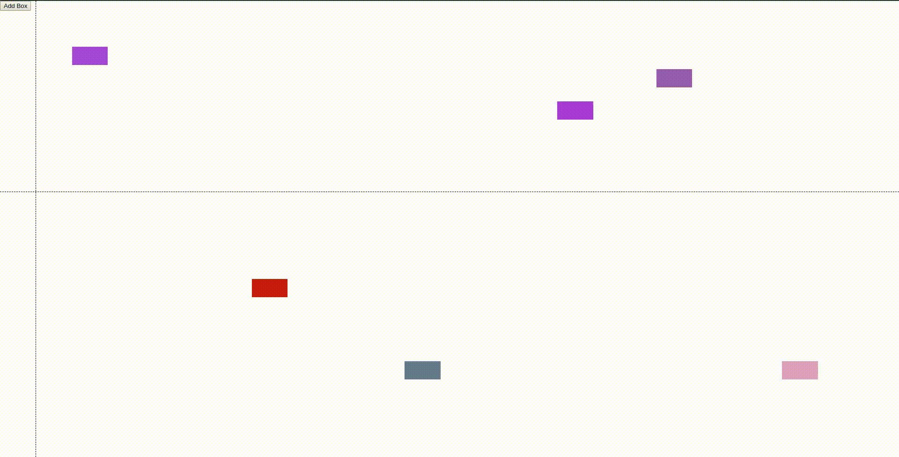

Front End Engineer Testing
==========================

There are three tests contained in this repo

- [Typescript Test](#typescript)
- [React Test](#react)
- [General Logic Test](#logic)

## System requirements:

These tests were created on a system with Node `v13.2.0` and npm `6.13.1`. Please make sure you are using these versions or later for this test.

## Webpack Build

For validation of the typescript test, and the react test, you will need to run the webpack build. You can run the dev server build with `npx webpack-dev-server` 

## Unit Tests

For validation of the logic test, you will need to run the unit tests. You can do this with `npx jest`

# Typescript

The typescript test requires you to add the correct typings to a generic function, such that all compilation warnings are removed from the webpack build. There should be no need to use the `any` type.

The files for this test can be found at `./src/typescript-test/`

The task where you should place your typings can be found at `./src/typescript-test/task.ts`.

## Answering

To validate that your answer is correct, the following typescript warnings should be absent from the webpack build:

```
ERROR in /home/james/fetest-march20/src/typescript-test/task.ts(44,27):
TS7006: Parameter 'array' implicitly has an 'any' type.
ERROR in /home/james/fetest-march20/src/typescript-test/task.ts(44,34):
TS7006: Parameter 'filterFn' implicitly has an 'any' type.
ERROR in /home/james/fetest-march20/src/typescript-test/task.ts(44,44):
TS7006: Parameter 'mapFn' implicitly has an 'any' type.
ERROR in /home/james/fetest-march20/src/typescript-test/task.ts(45,24):
TS7006: Parameter 'acc' implicitly has an 'any' type.
ERROR in /home/james/fetest-march20/src/typescript-test/task.ts(45,29):
TS7006: Parameter 'value' implicitly has an 'any' type.
ERROR in /home/james/fetest-march20/src/typescript-test/task.ts(45,36):
TS7006: Parameter 'index' implicitly has an 'any' type.
ERROR in /home/james/fetest-march20/src/typescript-test/task.ts(63,3):
TS7006: Parameter 'v' implicitly has an 'any' type.
ERROR in /home/james/fetest-march20/src/typescript-test/task.ts(64,4):
TS7006: Parameter 'v' implicitly has an 'any' type.
ERROR in /home/james/fetest-march20/src/typescript-test/task.ts(64,7):
TS7006: Parameter 'index' implicitly has an 'any' type.
ERROR in /home/james/fetest-march20/src/typescript-test/task.ts(69,3):
TS7006: Parameter 'v' implicitly has an 'any' type.
ERROR in /home/james/fetest-march20/src/typescript-test/task.ts(70,4):
TS7006: Parameter 'v' implicitly has an 'any' type.
ERROR in /home/james/fetest-march20/src/typescript-test/task.ts(70,7):
TS7006: Parameter 'index' implicitly has an 'any' type.
```

# React

This is a simple test of your ability to use React and general DOM manipulation. 

The files for this test can be found at `./src/react-test/`. 

You SHOULD NOT modify any existing functions in the `utils.ts` file, however, you may add to this file as you wish.

The application should sit inside the `main.tsx` file, but you are free to modify all JSX and CSS within this file and the `.pcss` files. You may also add your own folders and files to your liking to complete the task.

The goal of this test is for the candidate to build the application shown in the gif below:



The requirements are as follows:

- Coloured boxes should be generated with the `generateBox()` function, which can be found in `./src/react-test/utils.ts`.
- The application should start initially with 6 coloured boxes on the screen
- There should be a button somewhere on the page, which when clicked, will generate a new box.
- There should be a full screen crosshair drawn on the screen whose position is determined by the current cursor position, and "sticks" to a box when the box is under the cursor (see "Sticky Crosshairs" below for more info)
- When the cursor is over a box, the background colour of that box should be displayed near the crosshair center (see gif for example)

## Sticky crosshairs

When the users cursor is over a coloured box, the crosshair should attempt to "stick" to the box. This means that as the cursor moves around inside the box, the crosshair should not move as much, giving the illusion of "sticking" to the box.

As an example, imagine a 50px * 50px box. If the users cursor is direrctly in the center of the box, the position will be x: 25, y: 25. At this point, the crosshair should match the cursor. If the user then moves the cursor to the left, so that it is at x: 10, y: 25, then the crosshair should move left also, but not as far as the cursor because it is attempting to "stick" to the center of the box. So while the cursor position is x: 10, y: 25, the crosshair position may be x: 18, y: 25. This should apply in all directions from the center of the box.

Once the cursor leaves the box, the crosshair should revert to following the cursor exactly.

The ratio of "stickiness" and the calculation to perform this is up to you.

## Answering

The application will be built automatically by the webpack build. You should be able to see the live preview at http://localhost:8080

# Logic

The general logic test, just requires you to code a function such that the unit tests pass.

The files for this test can be found in `./src/logic-test/`.

The only file that should be edited is `./src/logic-test/task.ts`

## Answering

To verify that the test has been completed, the unit tests in the `test.ts` file should all pass.


